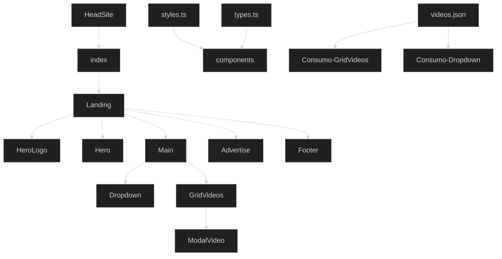
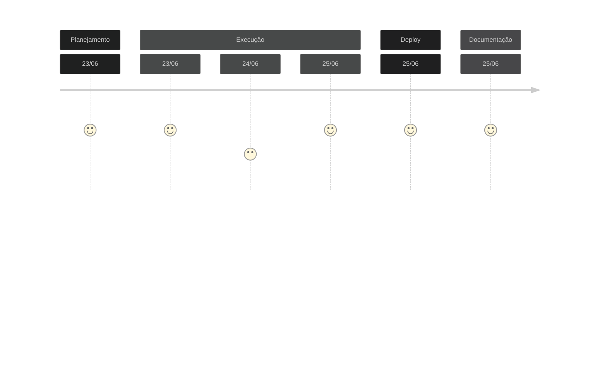

# Teste Advice Health FrontEnd - Agosto 2023

Bem vindo!
Esta é a solução encontrada para o desafio de Frontend React JS da empresa [Advice Health](https://advicehealth.com.br/) 

## 🌐 Acesso ao deploy no Vercel
[Deploy Advice Health](https://medical-office.vercel.app/) 

## 📋 Demanda
- [x] Desenvolver o front-end para um WebApp de consultório médico,
- [x] Utilizar HTML, CSS, Bootstrap e React;
- [x] Utilização de padrões de sintaxe e semântica de código;
- [x] Utilizar componentização para facilitar a implementação em futuras aplicações.

## ✍️ Desenvolvimento do Projeto

### Decisões de projeto
A proposta de desenvolvimento focou em 3 fatores principais, com foco na metodologia **DRY** `Don't Repeat Yourself`, **Clean Code** e **SOLID**.
- Consistência: buscou-se manter uma estrutura consistente em todo o código para facilitar a leitura e compreensão, com o uso de estilo de codificação consistente, incluindo a nomenclatura de variáveis, formatação, indentação e comentários.
- Clareza: a escrita do código foi realizada buscando-se a clareza e a legibilidade, evitando abreviações excessivas e utilizando nomes descritivos para funções, variáveis e classes. 
- Modularidade: o projeto se pautou pela divisão do mesmo em componente e funções menores e bem definidas, cada uma com uma responsabilidade específica, visando a manutenção, teste e reutilização do código.

### Organização do código
Na organização do código buscou-se seguer os seguintes princípios:
- Estrutura de diretórios: organização do código em uma estrutura de diretórios lógica e coerente, separando componentes distintos, como módulos, modelos, arquivos de configuração.
- Modularidade: divisão do código em arquivos e módulos separados, com base em sua funcionalidade ou propósito.
- Documentação: descritivo com uma documentação adequada para o projeto, descreve a finalidade do projeto, instruções para instalação, dependências, configuração e execução.

### Linha de Raciocínio
Para a realização do desafio estabeleci alguns parâmetros a seguir no desenvolvimento
- Inicialmente o projeto foi dividido em 3 partes principais `/desktop`, `/scheduler`, `/financial`, e dois módulos secundários `/header`, `/sidebarMenu`, seguindo a lógica de que cada componente será reutilizado em outros projetos. 
- A seção `/DesktopArea.js`, que renderiza o principal contexto do projeto, foi subdividida em outros componentes para apresentação dos resultados na tela, são eles: `/BarChart.js` (gráfico de consultas diárias na semana atual), `/DataContent.js` (box com informações de lotação diária e consultas diárias por médico), `/InsuranceTable.js` (tabela de acompanhamento das aprovações via convênio médico), `/Calendar.js` (calendário para consulta) e `/AppointmentList.js` (lista de agendamentos para o dia selecionado).
- A seção `/AppointmentScheduler.js`, que renderiza o contexto de agendamento de consulta, foi subdividida em áreas para apresentação dos resultados na tela, são eles: `Lista de Médicos` (lista de médicos que atendem no dia selecionado), `Agenda` (agenda diária demonstrando slots de tempo com e sem agendamento de pacientes), `Paciente` (formulário para criar paciente e realizar o agendamento da consulta).
- A seção `/Financial.js`, que renderiza o contexto de controle financeiro, apresenta uma tabela com as consultas realizadas na semana atual com possibilidades de filtragem e selecção por data, paciente e médico. Na mesma tabela pode-se verificar os pagamentos realizados.

### Simulação Banco de Dados
- Para popular as informações e simular um banco de dados ativo foram criados arquivos `.json` na pasta `/database`, seprarados em 5 arquivos: `appointment.json`, `doctors.json`, `insuranceAproval.json`, `insuranceCompany.json`, `patient.json`.

### Organograma Estrutural


### Linha do Tempo


## ⚙️ Linguagens de Programação Utilizadas
[](https://www.linkedin.com/in/targanski/)

## 🖥️ Documentação de Implantação

### Pré-requisitos
Antes de prosseguir com a implantação, é necessário garantir que o ambiente de desenvolvimento atenda aos seguintes pré-requisitos:
Node.js (versão 12 ou superior) instalado no servidor de hospedagem
Gerenciador de pacotes npm (ou yarn) instalado

### Etapas de Implantação
Siga as etapas abaixo para implantar o código web:

1. Clone o repositório do código web para o servidor de hospedagem.
```bash
git clone https://github.com/Ftarganski/leadster.git
```

2. Navegue até o diretório raiz do projeto clonado.

3. Execute o seguinte comando para instalar as dependências do projeto:
```bash
yarn install
```

4. Após a conclusão da instalação das dependências, execute o seguinte comando para iniciar a aplicação:
```bash
yarn dev
```
Este comando irá iniciar a aplicação no modo de desenvolvimento.

5. Acesse a aplicação web no navegador utilizando o endereço local: 
[http://localhost:3000](http://localhost:3000)

## 📄 Configurações Adicionais

### Metadados
A página inicial `/index.tsx` e o componente `/HeadSite.tsx` contêm metadados importantes para SEO e exibição nos motores de busca. Certifique-se de atualizar as informações conforme necessário, incluindo o título, descrição, palavras-chave e favicon.

### Imagens e Logos
Certifique-se de substituir as imagens de exemplo pelos arquivos corretos da sua aplicação. As imagens estão localizadas na pasta `/public/images`. Certifique-se de manter a estrutura correta de pastas e atualize as referências de imagem nos componentes apropriados.

### Dados dos Vídeos
O componente `/GridVideos.tsx` utiliza dados estáticos de vídeos a partir de um arquivo JSON `/Main/videos.json`. Certifique-se de atualizar os dados do arquivo JSON com os vídeos corretos da sua aplicação.

### Considerações Finais
Após a conclusão dessas etapas, o código web estará implantado e acessível por meio do servidor de hospedagem. Certifique-se de realizar os testes necessários para garantir que a aplicação esteja funcionando conforme o esperado.

Lembre-se de que esta documentação cobre apenas a implantação do código web. Outros aspectos, como implantação de banco de dados, configurações de servidor e escalabilidade, podem exigir etapas adicionais que não são abordadas aqui.

### Deploy de Desenvolvimento
O deploy de desenvolvimento foi realizado na plataforma Vercel e pode ser acessado em [Deploy Leadster](https://leadster-alpha.vercel.app/) 


======================================================


# Getting Started with Create React App

This project was bootstrapped with [Create React App](https://github.com/facebook/create-react-app).

## Available Scripts

In the project directory, you can run:

### `npm start`

Runs the app in the development mode.\
Open [http://localhost:3000](http://localhost:3000) to view it in your browser.

The page will reload when you make changes.\
You may also see any lint errors in the console.

### `npm test`

Launches the test runner in the interactive watch mode.\
See the section about [running tests](https://facebook.github.io/create-react-app/docs/running-tests) for more information.

### `npm run build`

Builds the app for production to the `build` folder.\
It correctly bundles React in production mode and optimizes the build for the best performance.

The build is minified and the filenames include the hashes.\
Your app is ready to be deployed!

See the section about [deployment](https://facebook.github.io/create-react-app/docs/deployment) for more information.

### `npm run eject`

**Note: this is a one-way operation. Once you `eject`, you can't go back!**

If you aren't satisfied with the build tool and configuration choices, you can `eject` at any time. This command will remove the single build dependency from your project.

Instead, it will copy all the configuration files and the transitive dependencies (webpack, Babel, ESLint, etc) right into your project so you have full control over them. All of the commands except `eject` will still work, but they will point to the copied scripts so you can tweak them. At this point you're on your own.

You don't have to ever use `eject`. The curated feature set is suitable for small and middle deployments, and you shouldn't feel obligated to use this feature. However we understand that this tool wouldn't be useful if you couldn't customize it when you are ready for it.

## Learn More

You can learn more in the [Create React App documentation](https://facebook.github.io/create-react-app/docs/getting-started).

To learn React, check out the [React documentation](https://reactjs.org/).

### Code Splitting

This section has moved here: [https://facebook.github.io/create-react-app/docs/code-splitting](https://facebook.github.io/create-react-app/docs/code-splitting)

### Analyzing the Bundle Size

This section has moved here: [https://facebook.github.io/create-react-app/docs/analyzing-the-bundle-size](https://facebook.github.io/create-react-app/docs/analyzing-the-bundle-size)

### Making a Progressive Web App

This section has moved here: [https://facebook.github.io/create-react-app/docs/making-a-progressive-web-app](https://facebook.github.io/create-react-app/docs/making-a-progressive-web-app)

### Advanced Configuration

This section has moved here: [https://facebook.github.io/create-react-app/docs/advanced-configuration](https://facebook.github.io/create-react-app/docs/advanced-configuration)

### Deployment

This section has moved here: [https://facebook.github.io/create-react-app/docs/deployment](https://facebook.github.io/create-react-app/docs/deployment)

### `npm run build` fails to minify

This section has moved here: [https://facebook.github.io/create-react-app/docs/troubleshooting#npm-run-build-fails-to-minify](https://facebook.github.io/create-react-app/docs/troubleshooting#npm-run-build-fails-to-minify)
