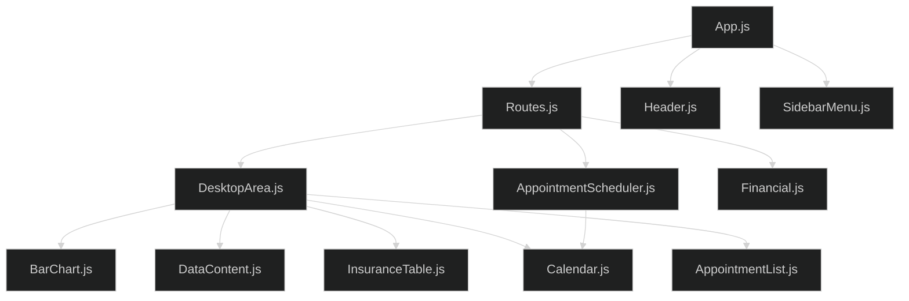
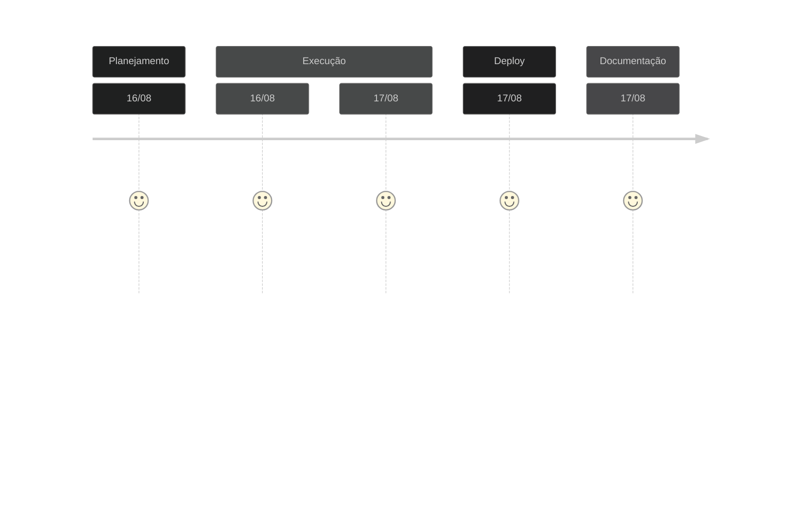

# Teste Advice Health FrontEnd - Agosto 2023

Bem vindo!
Esta é a solução encontrada para o desafio de Frontend React JS da empresa [Advice Health](https://advicehealth.com.br/) 

## 🌐 Acesso ao deploy no Vercel
[Deploy Advice Health](https://medical-office.vercel.app/) 

## 📋 Demanda
- [x] Desenvolver o front-end para um WebApp de consultório médico,
- [x] Utilizar HTML, CSS, JS, Bootstrap e React;
- [x] Utilização de padrões de sintaxe e semântica de código;
- [x] Utilizar componentização para facilitar a implementação em futuras aplicações.

## ✍️ Desenvolvimento do Projeto

### Decisões de projeto
A proposta de desenvolvimento focou em 3 fatores principais, com foco na metodologia **DRY** `Don't Repeat Yourself`, **Clean Code** e **SOLID**.
- Consistência: buscou-se manter uma estrutura consistente em todo o código para facilitar a leitura e compreensão, com o uso de estilo de codificação consistente, incluindo a nomenclatura de variáveis, formatação, indentação e comentários.
- Clareza: a escrita do código foi realizada buscando-se a clareza e a legibilidade, evitando abreviações excessivas e utilizando nomes descritivos para funções, variáveis e classes. 
- Modularidade: o projeto se pautou pela divisão do mesmo em componente e funções menores e bem definidas, cada uma com uma responsabilidade específica, visando a manutenção, teste e reutilização do código.

### Organização do código
Na organização do código buscou-se seguer os seguintes princípios:
- Estrutura de diretórios: organização do código em uma estrutura de diretórios lógica e coerente, separando componentes distintos, como módulos, modelos, arquivos de configuração.
- Modularidade: divisão do código em arquivos e módulos separados, com base em sua funcionalidade ou propósito.
- Documentação: descritivo com uma documentação adequada para o projeto, descreve a finalidade do projeto, instruções para instalação, dependências, configuração e execução.

### Linha de Raciocínio
Para a realização do desafio estabeleci alguns parâmetros a seguir no desenvolvimento
- Inicialmente o projeto foi dividido em 3 partes principais `/desktop`, `/scheduler`, `/financial`, e dois módulos secundários `/header`, `/sidebarMenu`, seguindo a lógica de que cada componente será reutilizado em outros projetos. 
- A seção `/DesktopArea.js`, que renderiza o principal contexto do projeto, foi subdividida em outros componentes para apresentação dos resultados na tela, são eles: `/BarChart.js` (gráfico de consultas diárias na semana atual), `/DataContent.js` (box com informações de lotação diária e consultas diárias por médico), `/InsuranceTable.js` (tabela de acompanhamento das aprovações via convênio médico), `/Calendar.js` (calendário para consulta) e `/AppointmentList.js` (lista de agendamentos para o dia selecionado).
- A seção `/AppointmentScheduler.js`, que renderiza o contexto de agendamento de consulta, foi subdividida em áreas para apresentação dos resultados na tela, são eles: `Lista de Médicos` (lista de médicos que atendem no dia selecionado), `Agenda` (agenda diária demonstrando slots de tempo com e sem agendamento de pacientes), `Paciente` (formulário para criar paciente e realizar o agendamento da consulta).
- A seção `/Financial.js`, que renderiza o contexto de controle financeiro, apresenta uma tabela com as consultas realizadas na semana atual com possibilidades de filtragem e selecção por data, paciente e médico. Na mesma tabela pode-se verificar os pagamentos realizados.

### Simulação Banco de Dados
- Para popular as informações e simular um banco de dados ativo foram criados arquivos `.json` na pasta `/database`, seprarados em 5 arquivos: `appointment.json`, `doctors.json`, `insuranceAproval.json`, `insuranceCompany.json`, `patient.json`.

### Organograma Estrutural


### Linha do Tempo


## ⚙️ Linguagens de Programação Utilizadas
[](https://www.linkedin.com/in/targanski/)

## 🖥️ Documentação de Implantação

### Pré-requisitos
Antes de prosseguir com a implantação, é necessário garantir que o ambiente de desenvolvimento atenda aos seguintes pré-requisitos:
Node.js (versão 12 ou superior) instalado no servidor de hospedagem
Gerenciador de pacotes npm instalado

### Etapas de Implantação
Siga as etapas abaixo para implantar o código web:

1. Clone o repositório do código web para o servidor de hospedagem.
```bash
git clone https://github.com/Ftarganski/leadster.git
```

2. Navegue até o diretório raiz do projeto clonado.

3. Execute o seguinte comando para instalar as dependências do projeto:
```bash
npm install
```

4. Após a conclusão da instalação das dependências, execute o seguinte comando para iniciar a aplicação:
```bash
npm start
```
Este comando irá iniciar a aplicação no modo de desenvolvimento.

5. Acesse a aplicação web no navegador utilizando o endereço local: 
[http://localhost:3000](http://localhost:3000)

### Build
```bash
npm run build
```
Para criar o aplicativo para produção na pasta `build`. Este comando irá empacotar o React no modo de produção e otimizar a compilação para obter o melhor desempenho. A compilação será minificada e os nomes dos arquivos itão incluir os hashes.

### Considerações Finais
Após a conclusão dessas etapas, o código web estará implantado e acessível por meio do servidor de hospedagem. Certifique-se de realizar os testes necessários para garantir que a aplicação esteja funcionando conforme o esperado.

Lembre-se de que esta documentação cobre apenas a implantação do código web. Outros aspectos, como implantação de banco de dados, configurações de servidor e escalabilidade, podem exigir etapas adicionais que não são abordadas aqui.

### Deploy de Desenvolvimento
O deploy de desenvolvimento foi realizado na plataforma Vercel e pode ser acessado em [Deploy Advice Health](https://medical-office.vercel.app/). 
